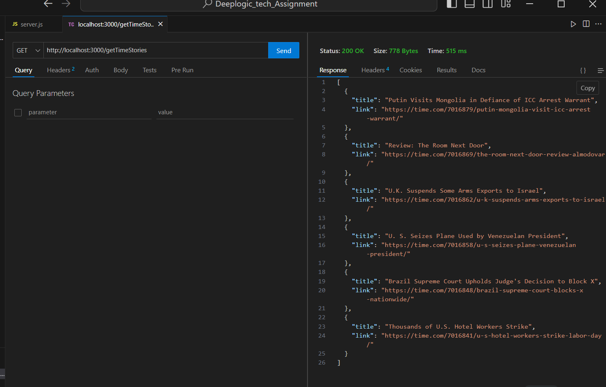

#Deeplogic_tech_Assignment
How to run this code:-
Step:1-Download this folder 

Step:2-Navigate to the directory.

Step:3-Run node server.js.

Step:4-Open Postman/thunder client and make a get request to http://localhost:3000/getTimeStories.

Step:5-Get the result

Result:-

